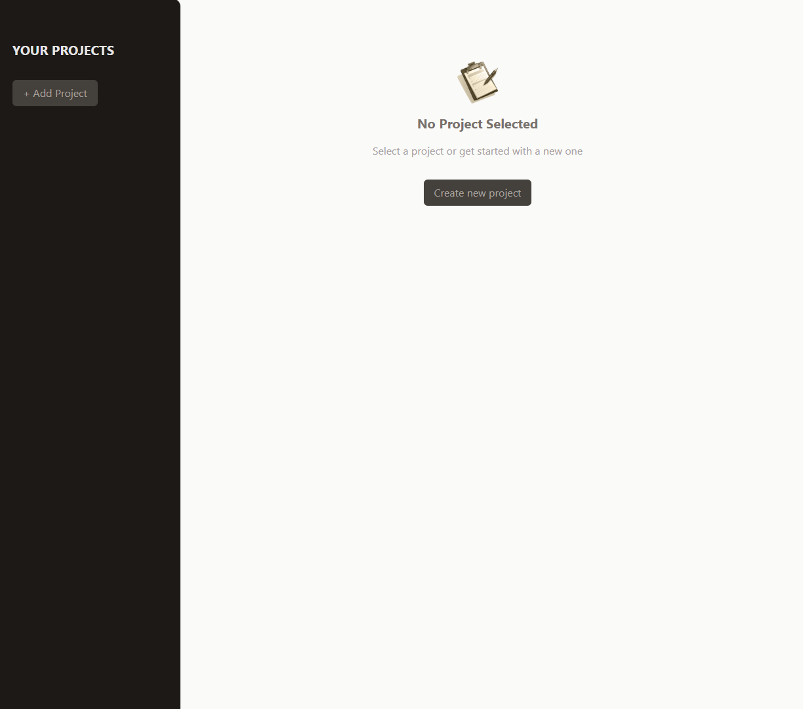
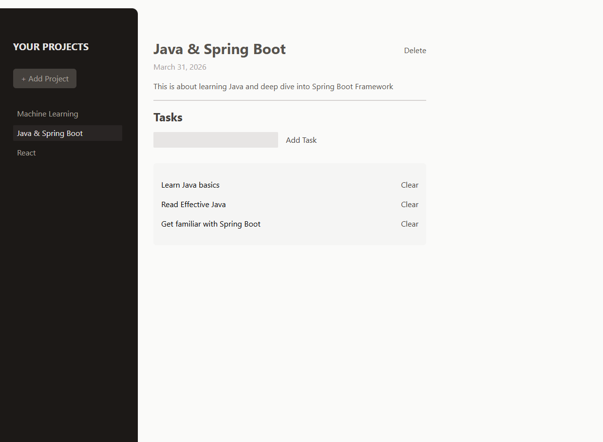

# 📋 Project Management App

A simple and clean project management app built with **React**. This project was created as part of **Maximilian Schwarzmüller's React course on Udemy**, focused on practicing core React concepts such as state management, component composition, and refs.

## 🚀 Live Demo

🔗 [gudratli-project-management.netlify.app](https://gudratli-project-management.netlify.app/)

## 📸 Screenshots

<div>
  
  
</div>

## ✨ Features

- Create and delete projects
- Add and remove tasks within each project
- Clean sidebar navigation between projects
- Modal dialogs for user feedback

## 🛠️ Tech Stack

- **React 19**
- **Vite**
- **Tailwind CSS**

## 📦 Getting Started

```bash
npm install
npm run dev
```

Happy coding!